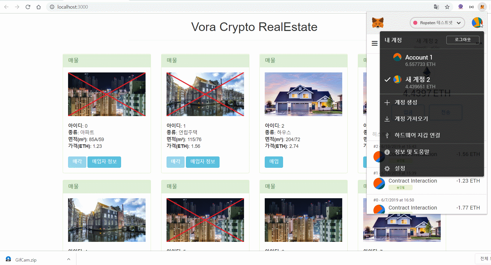
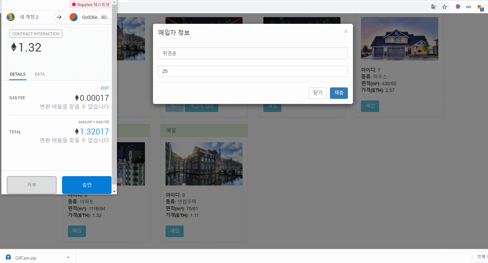
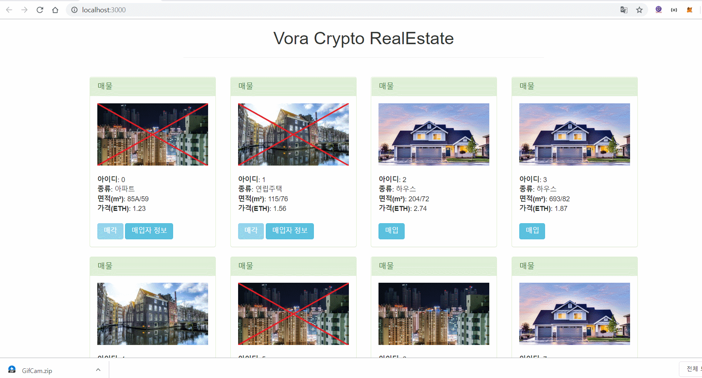
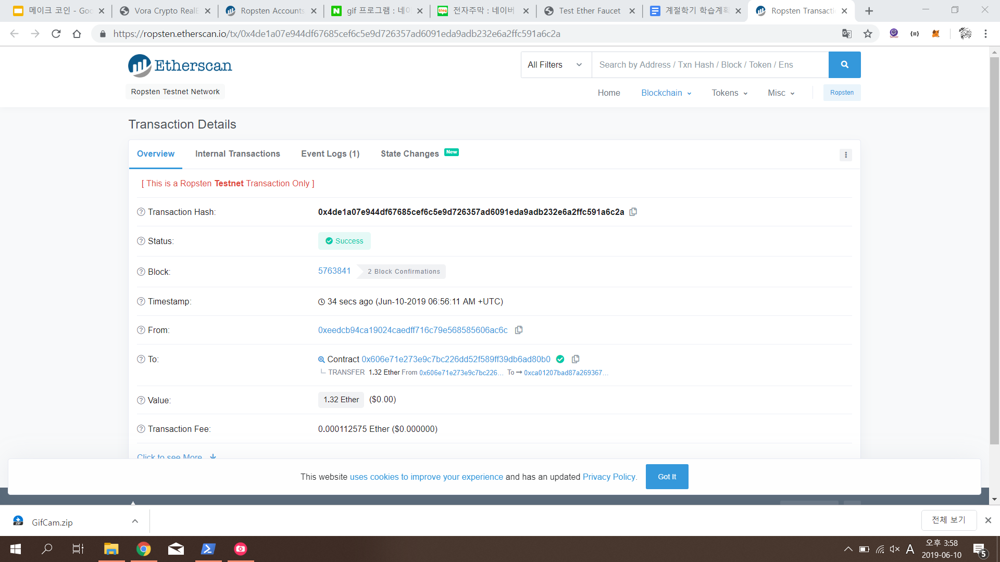
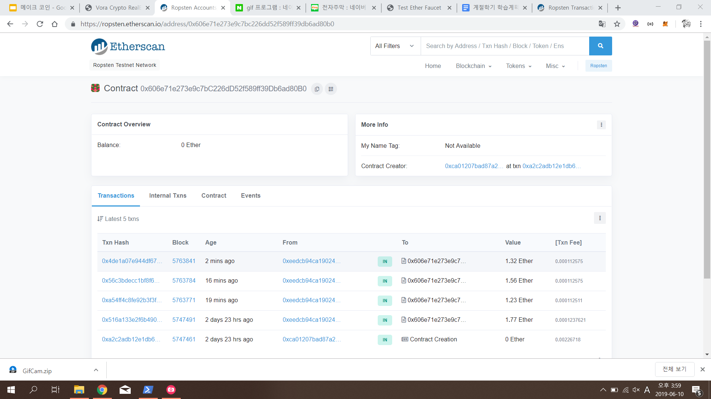

# Vora_Crypto_RealEstate

이더리움을 사용한 부동산 DApp 개발

## 개발 환경
* Solidity v0.4.25 (solc-js)
* Go Ethereum
* Truffle v4.1.15 (core : 4.1.15)
* Ganache v2.0.1

## 이슈(Issue)
1. Truffle 최신버전을 사용해 개발하고싶었으나 명령어가 바뀐 부분이 많아 구글링하며 진행함
   EVENT 명령어가 바뀐것을 해결하지 못해 결국 버전을 4로 낮춰서 진행함
   
   아래는 진행하면서 찾았었던 바뀐 명령어들
   
   * 계좌 확인 : `web3.eth.getAccounts()`
   * 한 계좌에 접근 : 
   1. `web3.eth.getAccounts().then(function(res){ return web3.eth.getBalance(res[0]).then(function(res2){ return web3.utils.fromWei(res2, 'ether')})})`
   
   2. `let accounts = await web3.eth.getAccounts()`
   `app.setStudentInfo(111, "sejong", "male", 7, {from: accounts[1]})`
 
 2. 스트링을 32bytes로 받으려면 web3.utils.fromAscii("aaa")로 바꿔줘야 하는듯 하다(?)
   * `app.buyRealEstate(0, web3.utils.fromAscii("sejong"), 13, {from:accounts[1], value:web3.utils.toWei((1.50).toString(), "ether")})`
   
 3. 자꾸 까먹던 실행 명령어
   * `npm run dev`

## 실행 화면
 
1. 매물 구매자 정보 입력 및 거래창까지

 
2. 거래부터 팬딩까지

 
3. 거래완료, 구매자 정보확인

 
4. 이더스캔 거래 정보

 
5. 이더스캔 거래 내역

## 참고 사이트
* https://truffleframework.com/docs/truffle/getting-started/interacting-with-your-contracts
* https://web3js.readthedocs.io/en/1.0/web3-eth.html
* https://www.inflearn.com/course/blockchain-%EC%9D%B4%EB%8D%94%EB%A6%AC%EC%9B%80-dapp/dashboard

